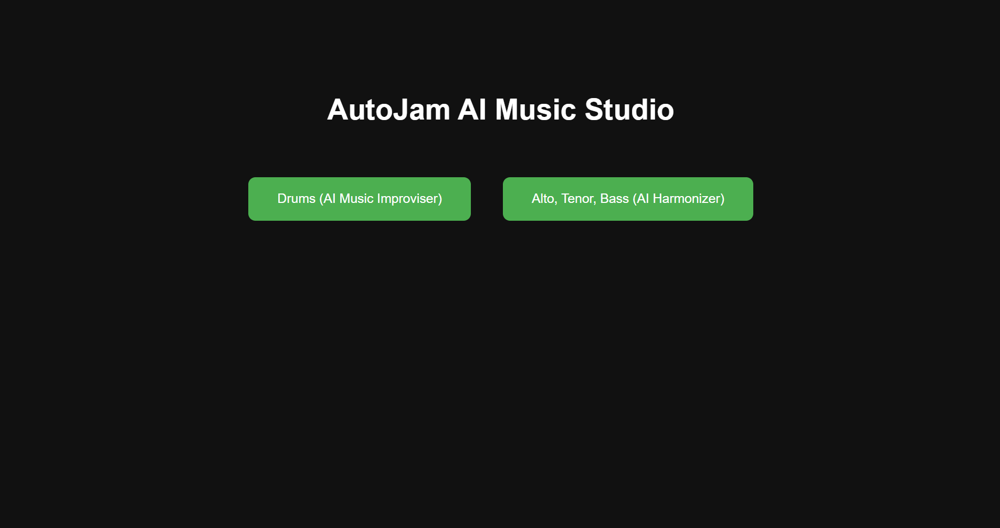
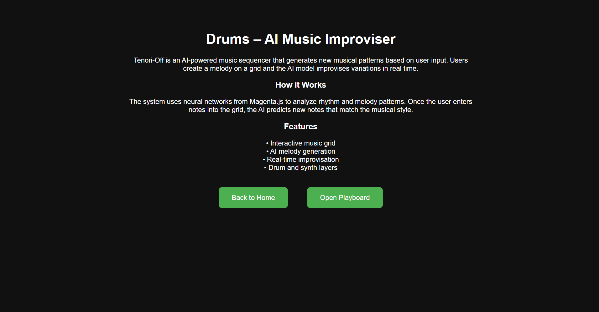
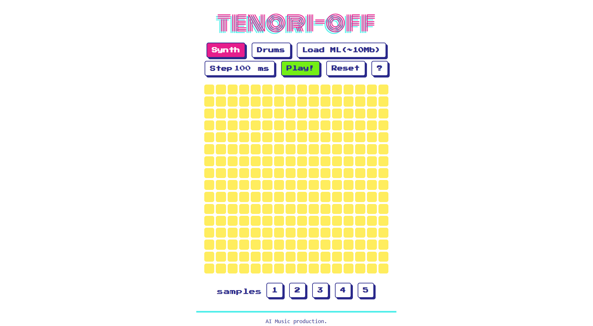
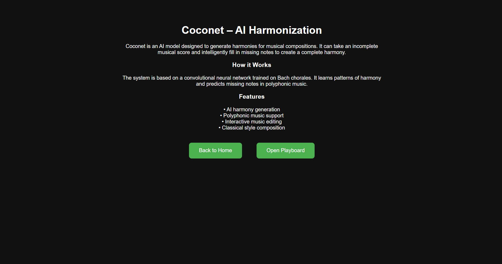
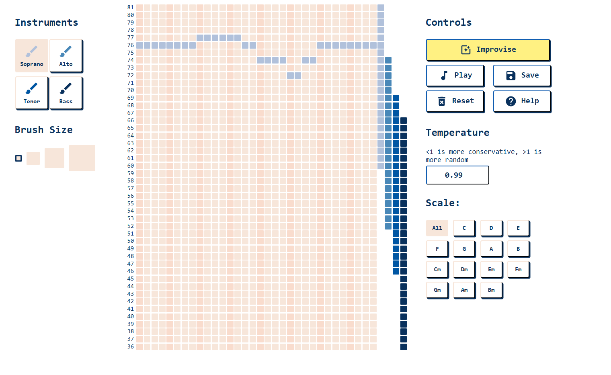

# AutoJam AI Music Studio 

An AI-powered music generation platform that creates melodies using modern web technologies.

## About This Project
This project was built as part of my MCA learning journey to explore AI and music generation.
Python is commonly used for prediction, detection and data analysis. 
But I was interested whether Python can be used in creative fields like Music.
So I build this project to demonstrate python in music generation.

## Enhancements & Customizations

This project has been extended beyond the original open-source version with the following improvements:

### Multi-Instrument Navigation UI
- Designed and implemented a structured UI that allows users to seamlessly navigate between different instrument modules.
- Improved overall user experience by organizing features into dedicated instrument pages.

### Expanded Instrument Support
- Integrated multiple instrument modules including:
  - Drums 
  - Piano (newly added)
  - Guitar (newly added)
- Each instrument has its own interactive interface for better usability and clarity.

### Improved User Experience
- Simplified navigation flow between instruments
- Reduced UI clutter by separating functionalities into focused sections
  
## Algorithm
- RNN
- drumsRNN
- melodyRNN

## Tech Stack
- Magenta.js
- Tone.js
- Tensorflow.js
- Canva
- SVG

## How to Run
- npm install
- npm start

## Screenshots

### Home Page

---

### Drums/Tenori-off Page

---

###  Drums Interface

---

### Piano/Coconet Page

---

###  Piano Interface

## Future Improvements
- Add user authentication
- Add more instruments like guitar, bass, and piano.
- Allow users to connect MIDI keyboards to play music.
- Let users export music as MIDI or WAV files.
- Use better AI models to create improved rhythms and melodies.
- Add cloud saving and collaboration to share music easily.

# Credits
This project is based on open-source implementations, customized and enhanced for learning and development purposes.
